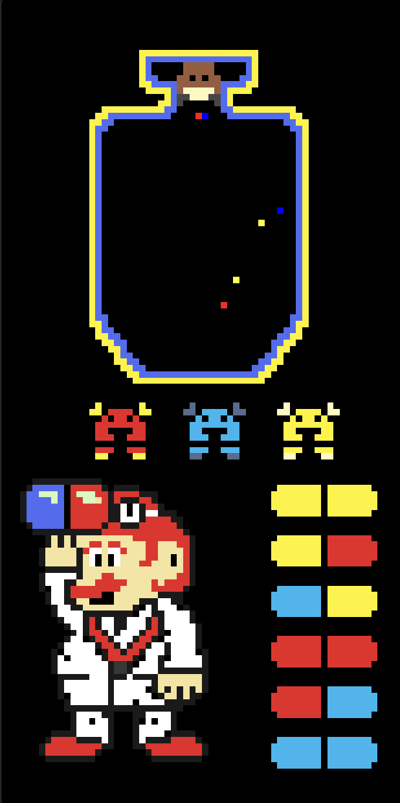

# Dr. Mario Assembly Implementation

A MIPS assembly implementation of the classic Nintendo game Dr. Mario, built for the Saturn MIPS simulator.



## Overview

This project recreates the classic Dr. Mario game in MIPS assembly, featuring a modern development environment with Saturn's built-in debugging tools and performance optimizations.

## Prerequisites

- [Saturn v0.1.9 or later](https://github.com/1whatleytay/saturn/releases/latest)
  - Windows: Download the `.msi` installer
  - macOS: Download the `.dmg` file
  - Linux: Choose either `.deb` or `.AppImage`

## Features

### Game Features
- Falling capsule mechanics with rotation
- Virus elimination through color matching
- Combo system
- Gravity simulation with increasing speed
- Collision detection
- Background music and sound effects
- Pause functionality

### Saturn-Specific Features
- In-line debugging support
- Real-time memory inspection
- Breakpoint setting
- Performance monitoring
- Modern UI interface

## Controls
- `W` - Rotate capsule
- `A` - Move left
- `S` - Move down (fast drop)
- `D` - Move right
- `P` - Pause game
- `Q` - Quit game
- `R` - Restart game

## Setup Instructions

1. Install Saturn MIPS simulator from the [latest release](https://github.com/1whatleytay/saturn/releases/latest)
2. Clone this repository:
```bash
git clone https://github.com/yourusername/dr-mario-assembly.git
```
3. Open Saturn and load the project
4. Configure display settings:
   - Width: 64 pixels
   - Height: 128 pixels
   - Unit Size: 1x1
   - Base Address: 0x10008000

## Project Structure

```
.
├── drmario.asm          # Main game logic
├── Resources/
│   └── data/           # Sprite and sound data
├── LICENSE             # MIT License
└── README.md           # This file
```

## Development

This project takes advantage of Saturn's modern features:
- Custom editor for MIPS assembly
- Integrated debugger
- Real-time value inspection
- Performance optimization tools

## Debugging Tips

Saturn provides several tools to help debug the game:
- Set breakpoints directly in the code
- Monitor register values in real-time
- Step through instructions
- View memory contents during execution

## License

This project is licensed under the MIT License - see the [LICENSE](LICENSE) file for details.

## Acknowledgments

- [Saturn MIPS Simulator](https://github.com/1whatleytay/saturn) - Modern MIPS development environment
- Original Dr. Mario game by Nintendo

## Author

Bhavya Jain

---

*Note: This project is built specifically for the Saturn MIPS simulator v0.1.9 or later. For the best experience, please ensure you're using the latest version of Saturn.* 